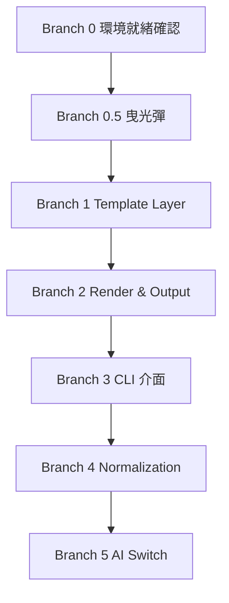

# Katachi（形）

**願景：** 個人使用的活動海報自動化 CLI 工具——輸入結構化資料，自動產出排版工整的海報 PNG 與 PDF，可選擇性啟用 LLM 進行內容潤飾。

---

## 核心工作流程

使用者準備一份 `event.json`，執行 `katachi generate event.json` 後，系統驗證欄位、選擇對應模板、透過 Jinja2 注入資料產生 HTML，再由 Playwright 渲染成 PNG 與 PDF，輸出至 `output/` 資料夾。若啟用 AI 模式（`--ai`），則在資料注入前先呼叫 LLM 對欄位進行摘要或改寫。

```
event.json
    │
    ▼
[Normalization]  驗證欄位、截斷過長文字、統一日期格式
    │
    ▼
[Template Layer] Jinja2 + HTML/CSS 模板（目前 1 個 pattern，預留擴充）
    │
    ▼
[Render Layer]   Playwright / Chromium → PNG + PDF
    │
    ▼
output/YYYY-MM-DD-{title}.png
output/YYYY-MM-DD-{title}.pdf
```

---

## Tech Stack

- **CLI：** Python（`typer` 或 `argparse`）
- **模板引擎：** Jinja2
- **渲染引擎：** Playwright（Chromium）
- **AI 層（可選）：** TBD（LLM API，透過 `--ai` flag 啟用）
- **部署：** 本機執行，無 server

---

## 視覺規範

- **風格：** 侘寂（Wabi-sabi）——留白、克制、自然感
- **模板管理：** `templates/` 資料夾，每個 pattern 為獨立子目錄（`pattern_01/index.html` + `style.css`）
- **動態樣式：** 透過 CSS Variables 注入主題色，不動 HTML 結構
- **文字保護：** 使用 CSS `clamp()` 防止長標題破版

---

## AI 協作守則

1. **最小修改原則：** 每次只做達成當前任務的最小修改，不得動到與任務無關的檔案或模組
2. **質疑新增：** 引入新 library 或建立新檔案前，必須先說明為何現有結構無法解決
3. **先求跑通，再求完美：** 重構是獨立任務，不在同一個 commit 內混做
4. **拒絕發散：** 一次 commit 只解決一件事
5. **AI 開關隔離：** LLM 邏輯只存在於 `ai_enricher.py`，不得滲入模板或渲染層
6. **完成的定義（DoD）：** 所有 success criteria 完成才算 done，不跳項

---

## Branch 依賴圖



> B1 → B2 → B3 → B4 必須依序完成；B5 可在 B3 完成後獨立開發。

---

## Branch 0：環境就緒確認

> 正式開發前的前置節點。確認所有依賴都就緒才能進入曳光彈。

**Input：** 開發機已有 Python 3.10+
**Output：** 所有工具確認可用
**Success criteria：**
- [ ] `python --version` 回傳 3.10+
- [ ] `pip install jinja2 playwright` 成功
- [ ] `playwright install chromium` 成功
- [ ] 執行 `playwright codegen` 不報錯（確認 Chromium 可啟動）

---

## Branch 0.5：曳光彈（Tracer Bullet）

> 用最少的程式碼走通一條完整路徑：一筆假資料 → HTML → PNG。
> 不求模組化，只求驗證整條管線可以跑通。

**目標路徑：** hardcoded dict → Jinja2 render → Playwright screenshot → `output/test.png`

**Input：** Branch 0 完成
**Output：** `output/test.png` 存在且內容正確
**Success criteria：**
- [ ] 一支 `tracer.py` 腳本可直接執行
- [ ] Jinja2 成功將假資料填入 HTML 模板
- [ ] Playwright 輸出 `output/test.png`，可用肉眼確認內容正確
- [ ] 不需要 CLI、不需要 JSON 讀檔，hardcoded 即可

---

## Branch 1：Template Layer

**Input：** Branch 0.5 曳光彈路徑可跑通
**Output：** 從 `event.json` 讀取資料並渲染出正確 HTML
**Success criteria：**
- [ ] [GREEN] `event.json` 所有欄位正確填入模板
- [ ] [GREEN] 模板路徑由 `template_id` 欄位決定（預留多模板擴充）
- [ ] [GREEN] 缺少非必要欄位時顯示預設值，不報錯
- [ ] [RED] 缺少必要欄位（`title`、`date`）時拋出明確錯誤訊息
- [ ] [REFACTOR] 模板載入邏輯封裝為獨立函式

---

## Branch 2：Render & Output

**Input：** Branch 1 完成，HTML 可正確產生
**Output：** `output/` 資料夾內有 PNG 與 PDF
**Success criteria：**
- [ ] [GREEN] 輸出 PNG，解析度足夠清晰（建議 2x viewport）
- [ ] [GREEN] 輸出 PDF，版面與 PNG 一致
- [ ] [GREEN] 檔名格式為 `YYYY-MM-DD-{title}.png / .pdf`
- [ ] [RED] Playwright 啟動失敗時給出可讀錯誤，不 silent crash
- [ ] [REFACTOR] 渲染邏輯封裝為 `renderer.py`

---

## Branch 3：CLI 介面

**Input：** Branch 2 完成
**Output：** 可從終端機執行 `katachi generate <file>`
**Success criteria：**
- [ ] [GREEN] `katachi generate event.json` 正常產出海報
- [ ] [GREEN] `--output` 可指定輸出資料夾
- [ ] [GREEN] `--format png|pdf|both` 可選擇輸出格式（預設 both）
- [ ] [RED] 傳入不存在的 JSON 路徑時給出清楚錯誤
- [ ] [REFACTOR] `--help` 說明完整清楚

---

## Branch 4：Normalization

**Input：** Branch 3 完成
**Output：** 系統對髒資料有防禦能力
**Success criteria：**
- [ ] [RED] 標題超過閾值字數時自動縮小字級（CSS `clamp` 搭配 class 注入）
- [ ] [RED] 日期格式不合法時報錯並說明正確格式
- [ ] [GREEN] 描述欄位過長時自動截斷並加 `…`
- [ ] [GREEN] `hero_image` 為 URL 時自動下載並快取到 `tmp/`
- [ ] [REFACTOR] 所有正規化邏輯集中在 `normalizer.py`

---

## Branch 5：AI Switch

**Input：** Branch 3 完成
**Output：** `--ai` flag 啟用時，LLM 對資料進行潤飾後再進入渲染管線
**Success criteria：**
- [ ] [GREEN] `katachi generate event.json --ai` 正常執行
- [ ] [GREEN] 關閉 `--ai` 時行為與原本完全一致（不影響 AI OFF 路徑）
- [ ] [GREEN] LLM 回傳格式不符時 fallback 使用原始資料，不 crash
- [ ] [RED] 未設定 API Key 時給出清楚提示
- [ ] [REFACTOR] 所有 LLM 邏輯封裝在 `ai_enricher.py`，不外洩到其他模組

---

## 當前狀態

**最後更新：** 2026-04-25
**目前進度：** Branch 0 準備中

### 下一步
- 確認 Python 環境與 Playwright 可正常啟動
- 建立 `event.json` schema 草稿
- 進入 Branch 0.5 曳光彈
