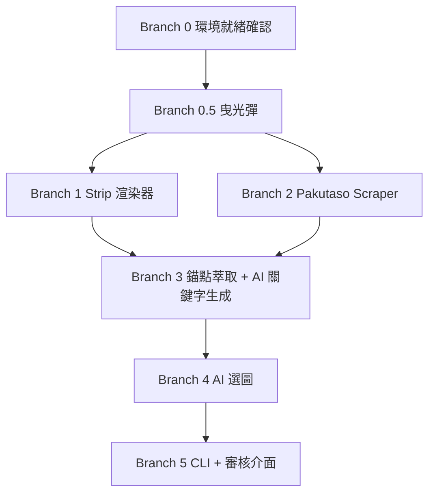

# Katachi（形）

**願景：** 個人使用的半自動照片帶生成 CLI 工具——輸入確認後的行程表，AI 從人事時地物中萃取錨點、搜尋日本在地圖片，挑出最能傳遞權威感與專業感的組合，使用者確認後輸出照片帶 PNG。

---

## 核心工作流程

```
行程表（人事時地物）
        │
        ▼
[錨點萃取]  從行程中提取：機構名、講師名、活動類型、地點
  地  → 「周南公立大学」「宮木脳神経外科病院」
  人  → 「栃木淳教授」「三川浩樹教授」
  事  → 「リハビリ実習」「介護技術講座」
        │
        ▼
[AI 關鍵字生成]  每個錨點轉換為 Pakutaso 可搜尋的日文關鍵字組
        │
        ▼
[Playwright 搜圖]  自動化瀏覽 Pakutaso，依關鍵字下載候選圖 20–30 張至 tmp/
        │
        ▼
[AI 選圖]  依「權威感、專業感」評估候選圖，挑出最佳 6–8 張並標注 weight
        │
        ▼
[使用者審核]  瀏覽器預覽，手動確認或替換（半自動的關鍵節點）
        │
        ▼
[Playwright 渲染]  Jinja2 注入選圖與 weight，輸出照片帶 PNG
        │
        ▼
output/{title}-strip.png
```

---

## Tech Stack

- **CLI：** Python（`typer`）
- **模板引擎：** Jinja2
- **瀏覽器自動化：** Playwright（Chromium）— 雙重用途：搜圖 + 渲染
- **圖片來源：** Pakutaso（日本免費圖庫，無需登入，Playwright 直接搜尋下載）
- **AI 層：** LLM API（TBD，負責錨點萃取、關鍵字生成、選圖評估）
- **部署：** 本機執行，無 server

---

## 輸入 Schema

```json
{
  "title": "日本照護技術研習廣島行",
  "schedule": [
    {
      "date": "6/15(一)",
      "location": "西風新都 Merry House / Merry Hospital / Merry Days",
      "activities": "長照機構參訪・復健醫院・照護課程・高齡飲食管理"
    },
    {
      "date": "6/17(三)",
      "location": "周南公立大学 人間健康学部",
      "activities": "福祉学科・看護学科 研修・復健課程"
    },
    {
      "date": "6/18(四)",
      "location": "宮木脳神経外科病院",
      "activities": "中風術後復健・返家照護流程參訪"
    },
    {
      "date": "6/19(五)",
      "location": "廣島大学醫学部",
      "activities": "三川浩樹教授 L8020 講座・認知症社会医学講座"
    }
  ]
}
```

> 行程表是搜圖的唯一錨點來源。地點名稱、講師名稱、活動內容三者決定搜尋關鍵字的精準度。

---

## 照片帶規格

- **尺寸：** 寬 794px × 高 115px（A4 全寬）
- **張數：** 6–8 張
- **Sizing：** 依 `weight` 值分配寬度（flex）
  - `weight: 2` → 約 2 倍寬，用於最具說服力的主圖
  - `weight: 1` → 標準寬度
- **構圖要求：** 橫向寬幅，主體置中（`object-fit: cover` 會裁邊緣）
- **色調：** 預設 `filter: grayscale(100%)` 統一視覺

---

## 選圖判斷標準（AI 選圖的依據）

照片帶的目的是**傳遞權威感與專業感，讓潛在參加者感到信賴與嚮往**。

| 優先級 | 元素 | 說明 | 建議 weight |
|--------|------|------|-------------|
| 1 | 講師 / 教授主講場景 | 直接對應行程中的「人」，建立學術公信力 | 2 |
| 2 | 機構外觀 + 日文招牌 | 對應行程中的「地」，証明真實存在 | 1.5 |
| 3 | 大學 / 醫院內部空間 | 環境本身就是專業感的載體 | 1.5 |
| 4 | 台日人員交流合影 | 跨國合作的視覺佐証 | 1 |
| 5 | 實務操作示範特寫 | 對應行程中的「事」，顯示學習深度 | 1 |
| 6 | 學員記筆記 / 討論 | 認真學習的氛圍 | 1 |
| 7 | 文化體驗 / 飯局 | 軟性元素，降低報名門檻 | 1 |

**選圖時應避免：** 病床特寫、悲傷表情、過度醫療感的畫面——與「研習旅遊」氛圍不符。

---

## AI 協作守則

1. **最小修改原則：** 每次只做達成當前任務的最小修改，不得動到與任務無關的檔案或模組
2. **質疑新增：** 引入新 library 或建立新檔案前，必須先說明為何現有結構無法解決
3. **先求跑通，再求完美：** 重構是獨立任務，不在同一個 commit 內混做
4. **拒絕發散：** 一次 commit 只解決一件事
5. **模組邊界嚴格分離：**
   - `anchor_extractor.py` — 從行程表萃取人事地物錨點
   - `keyword_generator.py` — 錨點 → 日文搜尋關鍵字
   - `scraper.py` — Pakutaso 搜尋與下載
   - `photo_selector.py` — AI 選圖與 weight 建議
   - `renderer.py` — Jinja2 + Playwright 渲染
6. **完成的定義（DoD）：** 所有 success criteria 完成才算 done，不跳項

---

## Branch 依賴圖



> B1 與 B2 可平行開發；B3 需要兩者都完成後才能串接。

---

## Branch 0：環境就緒確認

**Input：** 開發機已有 Python 3.10+
**Output：** 所有工具確認可用
**Success criteria：**
- [ ] `python --version` 回傳 3.10+
- [ ] `pip install jinja2 playwright typer` 成功
- [ ] `playwright install chromium` 成功
- [ ] Playwright 可成功開啟 Pakutaso 首頁，不被封鎖
- [ ] LLM API Key 設定完成（`.env` 檔）

---

## Branch 0.5：曳光彈（Tracer Bullet）

> 用最少程式碼走通完整路徑：hardcoded 關鍵字 → Pakutaso 下載 1 張 → 渲染照片帶 PNG。
> 不求模組化，只求驗證整條管線可以跑通。

**目標路徑：** `tracer.py` hardcoded 日文關鍵字 → Playwright 搜尋 Pakutaso → 下載 1 張 → Jinja2 + Playwright 輸出 `output/test-strip.png`

**Input：** Branch 0 完成
**Output：** `output/test-strip.png` 存在，可肉眼確認照片出現在帶狀版面中
**Success criteria：**
- [ ] `python tracer.py` 可直接執行，不需任何參數
- [ ] Playwright 成功在 Pakutaso 搜尋並下載至少 1 張圖至 `tmp/`
- [ ] Jinja2 將圖片路徑注入照片帶模板
- [ ] Playwright 輸出 `output/test-strip.png`，照片可見、不破版

---

## Branch 1：Strip 渲染器

**Input：** Branch 0.5 完成
**Output：** `renderer.py`，接收含 weight 的 photos list，輸出照片帶 PNG
**Success criteria：**
- [ ] [GREEN] 傳入含 `src` 與 `weight` 的 photos list，輸出正確比例的照片帶 PNG
- [ ] [GREEN] `weight: 2` 的照片寬度約為 `weight: 1` 的兩倍
- [ ] [GREEN] 照片帶尺寸 794 × 115px，2x 輸出解析度清晰
- [ ] [RED] 圖片路徑不存在時拋出明確錯誤，不 silent crash
- [ ] [REFACTOR] 邏輯封裝為 `renderer.py`，可獨立呼叫

---

## Branch 2：Pakutaso Scraper

**Input：** Branch 0.5 完成
**Output：** `scraper.py`，接收日文關鍵字 list，下載候選圖至 `tmp/`
**Success criteria：**
- [ ] [GREEN] 傳入日文關鍵字，Playwright 自動搜尋 Pakutaso 並下載圖片至 `tmp/`
- [ ] [GREEN] 可指定下載數量上限（預設 20 張）
- [ ] [GREEN] 重複執行時跳過已下載圖片（hash 去重）
- [ ] [RED] 無搜尋結果時回傳空 list 並提示，不 crash
- [ ] [REFACTOR] 邏輯封裝為 `scraper.py`，與渲染完全解耦

---

## Branch 3：錨點萃取 + AI 關鍵字生成

**Input：** Branch 1 + Branch 2 完成
**Output：** `anchor_extractor.py` + `keyword_generator.py`
**Success criteria：**
- [ ] [GREEN] 從行程表 JSON 萃取地點名、講師名、活動類型等錨點
- [ ] [GREEN] 每個錨點轉換為 2–3 組 Pakutaso 可搜尋的日文關鍵字
- [ ] [GREEN] LLM 回傳格式不符時 fallback 使用行程地點名直接搜尋
- [ ] [RED] 未設定 API Key 時給出明確提示
- [ ] [REFACTOR] 兩個模組各自獨立，可單獨測試

---

## Branch 4：AI 選圖

**Input：** Branch 3 完成
**Output：** `photo_selector.py`，回傳含 weight 的最終選圖 list
**Success criteria：**
- [ ] [GREEN] 傳入候選圖路徑 list，依選圖判斷標準回傳 6–8 張 + weight
- [ ] [GREEN] 選圖優先順序符合規格表（講師 > 機構外觀 > 合影…）
- [ ] [GREEN] LLM 回傳格式錯誤時 fallback 使用等寬選前 6 張
- [ ] [RED] 候選圖少於 3 張時給出警告並繼續，不中止
- [ ] [REFACTOR] 邏輯封裝在 `photo_selector.py`，不依賴其他模組

---

## Branch 5：CLI + 審核介面

**Input：** Branch 4 完成
**Output：** `katachi strip` 可端到端執行，含使用者審核步驟
**Success criteria：**
- [ ] [GREEN] `katachi strip events/sample.json` 完整跑完流程
- [ ] [GREEN] AI 選圖完成後自動在瀏覽器開啟預覽，等待使用者確認
- [ ] [GREEN] 使用者輸入 `y` 後輸出最終 PNG 至 `output/`
- [ ] [GREEN] 使用者輸入 `n` 後可重新搜尋或手動指定替換圖片
- [ ] [GREEN] `--output` 可指定輸出資料夾
- [ ] [RED] 任何階段失敗時顯示是哪個模組出錯，不丟裸 traceback
- [ ] [REFACTOR] `--help` 說明完整清楚

---

## 當前狀態

**最後更新：** 2026-04-25
**目前進度：** Branch 0 準備中

### 下一步
- 確認 Python 環境與 Playwright 可正常開啟 Pakutaso
- 決定 LLM API（B3 需要）
- 進入 Branch 0.5 曳光彈
