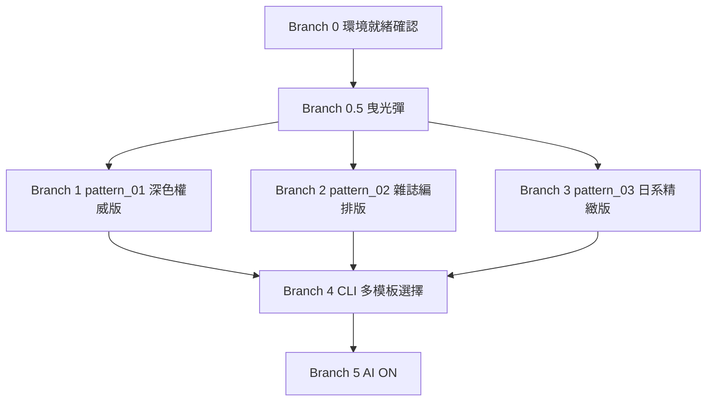

# Katachi（形）

**願景：** 個人使用的活動海報自動化 CLI 工具——輸入 event.json，自動產出 3 種不同設計風格的 A4 海報 PNG 與 PDF，同樣的資訊密度、不同的視覺語言。

---

## 核心工作流程

```
event.json（標題、日期、特點、行程、費用、聯絡）
        │
        ▼
[Template Layer]  Jinja2 注入資料至指定設計模板
        │
        ▼
[Render Layer]  Playwright / Chromium 渲染 HTML → PNG + PDF
        │
        ▼
output/{title}-{pattern}.png
output/{title}-{pattern}.pdf
```

---

## Tech Stack

- **CLI：** Python（`typer`）
- **模板引擎：** Jinja2
- **渲染引擎：** Playwright（Chromium）
- **AI 層（預留）：** TBD，未來 B5 加入
- **部署：** 本機執行，無 server

---

## 三套設計模板

同樣的 event.json 資料，三套完全不同的視覺設計。

### pattern_01 — 深色權威版
- **底色：** 深藍黑（`#0D1B2A`）
- **主色：** 金色（`#C9A84C`）
- **文字：** 白色
- **風格：** 高端研討會手冊感，照片帶有暗角處理
- **適合：** 學術性、國際性活動

### pattern_02 — 雜誌編排版
- **底色：** 白
- **主色：** 鮮明的品牌色（深藍 `#1B3F78` + 橘紅 `#E8490C`）
- **風格：** 不對稱版面、大色塊分區、強烈的版式層次
- **適合：** 需要視覺張力、吸引眼球的活動

### pattern_03 — 日系精緻版
- **底色：** 米白（`#F7F3EE`）
- **主色：** 深藍（`#1B3F78`）+ 細線條
- **風格：** 留白、細節精緻、呼應 Katachi 的設計語言
- **適合：** 台日合作、文化感強的活動

---

## 輸入 Schema（event.json）

```json
{
  "template_id": "pattern_01",
  "subtitle": "十餘年台日養老產業強強俱樂部交流結晶，轉換成精實研習營",
  "title": "日本照護技術研習",
  "badge_text": "贏",
  "meta_tag": "精實研習",
  "location_tag": "廣島行",
  "date_start_display": "2026/6/14(日)",
  "date_end_display": "6/21(日)",
  "highlights": [
    { "label": "探索優質養老設施", "detail": "廣島 Top 5 老人院・深度交流 & 觀摩。" }
  ],
  "photos": [
    { "src": "photos/01.jpg", "weight": 2 },
    { "src": "photos/02.jpg", "weight": 1 }
  ],
  "sidebar_image": "sidebar.jpg",
  "sidebar_caption": "嗜下調整食 レシピ 123",
  "schedule": [
    { "date": "6/15(一)", "location": "Merry House", "activities": "長照機構參訪" }
  ],
  "description": "研習計劃召集學員15名...",
  "pricing_note": "研習課程(翻譯)+移動+住宿半自理",
  "price_regular": 65000,
  "price_group": 63000,
  "price_group_label": "二位團報優惠價",
  "price_deposit": 10000,
  "organizer": "哩哩哩樂遊學股份有限公司",
  "contact_name": "林伯彥",
  "contact_phone": "02-2252-3030 #600"
}
```

---

## AI 協作守則

1. **最小修改原則：** 每次只做達成當前任務的最小修改，不得動到與任務無關的檔案或模組
2. **質疑新增：** 引入新 library 或建立新檔案前，必須先說明為何現有結構無法解決
3. **先求跑通，再求完美：** 重構是獨立任務，不在同一個 commit 內混做
4. **拒絕發散：** 一次 commit 只解決一件事
5. **模板獨立原則：** 三套模板的 HTML/CSS 完全獨立，不共用結構，只共用 Jinja2 變數名稱
6. **完成的定義（DoD）：** 所有 success criteria 完成才算 done，不跳項

---

## Branch 依賴圖



> B1、B2、B3 三套模板可完全平行開發，互不依賴。

---

## Branch 0：環境就緒確認

**Input：** 開發機已有 Python 3.10+
**Output：** 所有工具確認可用
**Success criteria：**
- [ ] `python --version` 回傳 3.10+
- [ ] `pip install jinja2 playwright typer` 成功
- [ ] `playwright install chromium` 成功
- [ ] 執行 `playwright codegen` 不報錯（確認 Chromium 可啟動）

---

## Branch 0.5：曳光彈（Tracer Bullet）

> 用最少程式碼走通完整路徑：sample.json → Jinja2 → Playwright → PNG。
> 用現有的 pattern_01 模板，只求驗證管線跑通，不求設計好看。

**目標路徑：** `tracer.py` 讀取 `events/sample.json` → Jinja2 渲染 HTML → Playwright 輸出 `output/test.png`

**Input：** Branch 0 完成
**Output：** `output/test.png` 存在，可肉眼確認資料正確填入
**Success criteria：**
- [ ] `python tracer.py` 可直接執行，不需任何參數
- [ ] Jinja2 成功將 sample.json 資料填入 pattern_01 模板
- [ ] Playwright 輸出 `output/test.png`，標題、日期等欄位可讀
- [ ] 不需要 CLI 框架，hardcoded 路徑即可

---

## Branch 1：pattern_01 — 深色權威版

> 重新設計 templates/pattern_01/，達到深色高端設計水準。

**Input：** Branch 0.5 曳光彈跑通
**Output：** `templates/pattern_01/` 完整 HTML/CSS，視覺達到設計水準
**Success criteria：**
- [ ] [GREEN] 深藍黑底色，金色標題與強調元素
- [ ] [GREEN] 照片帶套用暗角處理（CSS `linear-gradient` overlay）
- [ ] [GREEN] 所有 event.json 欄位正確呈現，不破版
- [ ] [GREEN] 長標題、長說明文字不破版（CSS `clamp` + 截斷保護）
- [ ] [GREEN] A4 尺寸（794px 寬），2x 輸出 PNG 解析度清晰
- [ ] [RED] 缺少必要欄位時顯示預設值，不報錯

---

## Branch 2：pattern_02 — 雜誌編排版

> 建立 templates/pattern_02/，不對稱版面、強烈色塊。

**Input：** Branch 0.5 曳光彈跑通
**Output：** `templates/pattern_02/` 完整 HTML/CSS
**Success criteria：**
- [ ] [GREEN] 白底，深藍與橘紅色塊分區
- [ ] [GREEN] 版面有明顯的視覺層次（主標題 > 特點 > 行程 > 費用）
- [ ] [GREEN] 所有 event.json 欄位正確呈現，不破版
- [ ] [GREEN] 長文字不破版
- [ ] [GREEN] A4 尺寸，2x 輸出 PNG 解析度清晰
- [ ] [RED] 缺少必要欄位時顯示預設值，不報錯

---

## Branch 3：pattern_03 — 日系精緻版

> 建立 templates/pattern_03/，米白底、細線條、留白感。

**Input：** Branch 0.5 曳光彈跑通
**Output：** `templates/pattern_03/` 完整 HTML/CSS
**Success criteria：**
- [ ] [GREEN] 米白底色，深藍細線條分隔區塊
- [ ] [GREEN] 字體層次精緻，有日系設計感
- [ ] [GREEN] 所有 event.json 欄位正確呈現，不破版
- [ ] [GREEN] 長文字不破版
- [ ] [GREEN] A4 尺寸，2x 輸出 PNG 解析度清晰
- [ ] [RED] 缺少必要欄位時顯示預設值，不報錯

---

## Branch 4：CLI 多模板選擇

**Input：** Branch 1 + 2 + 3 全部完成
**Output：** `katachi generate` 可指定模板輸出海報
**Success criteria：**
- [ ] [GREEN] `katachi generate events/sample.json` 使用 JSON 內的 `template_id`
- [ ] [GREEN] `katachi generate events/sample.json --template pattern_02` 可覆蓋模板
- [ ] [GREEN] `katachi generate events/sample.json --all` 三套模板一次全部輸出
- [ ] [GREEN] `--output` 可指定輸出資料夾
- [ ] [RED] 指定不存在的 template_id 時給出清楚錯誤
- [ ] [REFACTOR] `--help` 說明完整

---

## Branch 5：AI ON（預留）

> 未來加入 LLM 輔助層，處理內容摘要、行程解析、選圖等功能。
> 此 Branch 暫不展開，待 B4 完成後再規劃。

---

## 當前狀態

**最後更新：** 2026-04-25
**目前進度：** Branch 0 準備中

### 下一步
- 確認 Python 環境與 Playwright 可正常啟動
- 進入 Branch 0.5 曳光彈（用現有 pattern_01 驗證管線）
- 曳光彈跑通後，三套模板可平行開發
